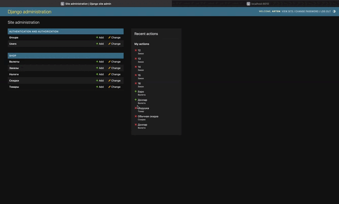
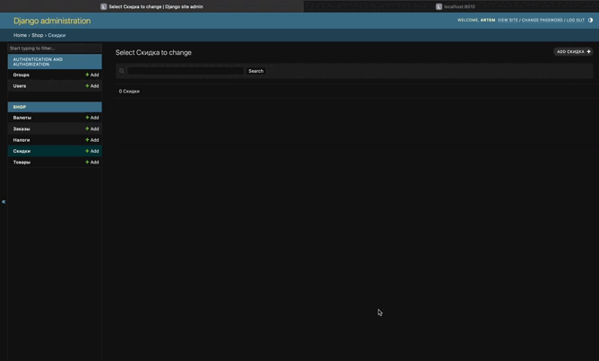

# Тестовое задание для Простые решения

## Как запустить проект

1. Склонировать репозиторий
2. Создать `.env` файл в корне проекта и заполнить его по примеру `.env.example`
3. Выполнить команду `docker-compose up -d --build`

## Описание переменных окружения

+ SECRET_KEY - секретный ключ проекта 
+ DEBUG - режим отладки 
+ DB_NAME - название БД 
+ DB_USER - имя пользователя БД 
+ DB_PASSWORD - пароль пользователя БД 
+ DB_HOST - хост БД. По умолчанию `db` т.к. название контейнера с БД `db`
+ DB_PORT - порт БД. По умолчанию `5432` т.к. порт БД контейнера `5432`
+ STRIPE_API_KEY - приватный ключ в кабинете Stripe 
+ CURRENT_DOMAIN - текущий домен. По умолчанию `http://localhost:8010`

## Описание моделей которые сопряжены со Stripe

### Item

Модель товара. Содержит следующие поля:

+ name - название товара
+ price_stripe - цена товара в Stripe
+ price_for_view - цена товара для отображения
+ description - описание товара

### Discount

Модель скидки. Содержит следующие поля:

+ name - название скидки
+ stripe_id - id скидки в Stripe
+ amount - на сколько процентов скидка. Служит только для отображения на странце

## Процесс покупки одного товара

## Процесс покупки нескольких товаров со скидкой

